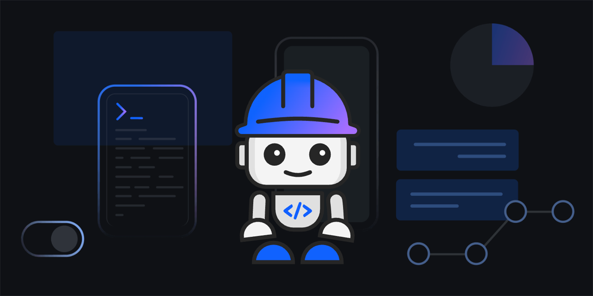

# Agentic AI Workshop



Build intelligent applications with IBM Bob — an AI-powered development environment that transforms how you write code, automate workflows, and integrate with external tools.

<div align="center">

[](guides/Bob%20IDE.md)
&nbsp;
[](guides/Bob%20Shell.md)

</div>


## 🎯 What You'll Learn

### Bob IDE Workshop
**Duration:** ~1 hour | **Difficulty:** Beginner

Build a complete To-Do List application using all five Bob IDE modes:
- ❓ **Ask Mode** — Get explanations and understand concepts
- 📝 **Plan Mode** — Design architecture before coding
- 💻 **Code Mode** — Write and modify code efficiently
- 🛠️ **Advanced Mode** — Complex tasks with full tool access
- 🔀 **Orchestrator Mode** — Coordinate multi-step projects

**Plus:** MCP integration with Monday.com and automated PowerPoint generation using Skills.

[**Start the Bob IDE Workshop →**](guides/Bob%20IDE.md)

---

### Bob Shell Workshop
**Duration:** ~30 minutes | **Difficulty:** Beginner

Create autonomous automation workflows:
- 💬 **Interactive Sessions** — Terminal-based AI assistance
- ⚡ **Non-Interactive Mode** — Fully automated task execution
- 🤖 **PR Review Automation** — AI-powered code reviews on schedule
- 📊 **Standup Reports** — Automated Monday.com status updates

[**Start the Bob Shell Workshop →**](guides/Bob%20Shell.md)

## 🚀 Quick Start

### Prerequisites

Both workshops require:
- **IBM Bob** — Request access at [w3.ibm.com/w3publisher/bob](https://w3.ibm.com/w3publisher/bob)
- **Git** — Version control system
- **Workshop Repository** — Clone or download this repo

Bob Shell workshop additionally requires:
- **Node.js** — Runtime for Bob Shell
- **jq** (Mac/Linux only) — JSON processor for scripts

### Installation

```bash
# Clone the workshop repository
git clone https://github.ibm.com/Justine-Gillian-Pascua/bob-agentic-ai-workshop
cd bob-agentic-ai-workshop

# For Bob IDE workshop, open the app folder
# File → Open Folder → select the 'app' folder

# For Bob Shell workshop, navigate to your project directory
cd your-project
```

## 📖 Workshop Structure

### Part 1: Bob IDE Modes
Learn the five specialized modes and build a working application step-by-step.

### Part 2: MCP Integration
Connect Bob to external tools like Monday.com for productivity automation.

### Part 3: Skills
Use reusable Skills for specialized tasks like automated PowerPoint generation.

### Part 4: Bob Shell
Set up autonomous workflows with terminal-based automation for PR reviews and standup reports.

## 🛠️ Key Technologies

- **IBM Bob IDE** — AI-powered development environment
- **IBM Bob Shell** — Terminal-based AI automation
- **MCP (Model Context Protocol)** — External tool integration
- **Skills** — Reusable prompt templates for specialized tasks
- **Monday.com** — Project management integration
- **GitHub** — Code review automation

## 📝 What You'll Build

| Workshop | Output |
|----------|--------|
| **Bob IDE** | To-Do List web app + Monday.com sprint board + PowerPoint presentation |
| **Bob Shell** | Automated PR review system + Daily standup report generator |


## 🤝 Support

- **Questions during the workshop?** Ask in the session chat or use Bob's Ask Mode
- **Technical issues?** Check the Prerequisites section in each guide
- **Want to learn more?** Explore the [IBM Bob documentation](https://internal.bob.ibm.com/docs/ide) and [skills.sh](https://www.skills.sh/)


## 📄 License

This workshop is provided for IBM internal use. All materials are subject to IBM's internal policies and guidelines.

---

<div align="center">

**Ready to get started?**

[Bob IDE Workshop](guides/Bob%20IDE.md) • [Bob Shell Workshop](guides/Bob%20Shell.md)

</div>