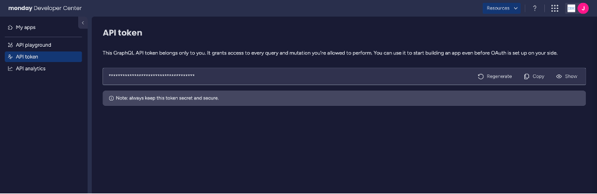
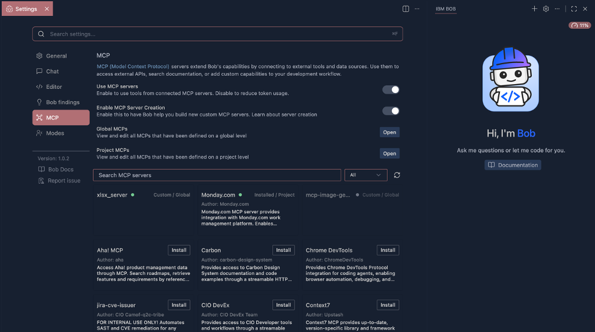

# Agentic AI Workshop - IBM Bob IDE

## Hands-On Lab Guide

### Using Bob IDE to Build with AI

**What you'll build:** A simple To-Do List app — built step by step using all five Bob IDE modes, extended with a productivity MCP integration, and wrapped up with a Skills-generated PowerPoint presentation.

**Estimated Duration:** ~1 hour | **Difficulty:** Beginner

## Table of Contents

- [Introduction](#introduction)
  - [What is Bob IDE?](#what-is-bob-ide)
  - [Key Concepts](#key-concepts)
  - [Before You Start](#before-you-start)
- [Prerequisites](#prerequisites)
  - [Prerequisite 1 of 2 — IBM Bob IDE](#prerequisite-1-of-2--ibm-bob-ide)
  - [Prerequisite 2 of 2 — Git](#prerequisite-2-of-2--git)
  - [Prerequisite 3 of 3 — Workshop Repository](#prerequisite-3-of-3--workshop-repository)
  - [Pre-Workshop Checklist](#pre-workshop-checklist)
- [Bob IDE Modes at a Glance](#bob-ide-modes-at-a-glance)
- [Part 1 — Bob IDE Modes](#part-1--bob-ide-modes)
  - [Mode 1: Ask Mode ❓](#mode-1-ask-mode-)
  - [Mode 2: Plan Mode 📝](#mode-2-plan-mode-)
  - [Mode 3: Code Mode 💻](#mode-3-code-mode-)
  - [Mode 4: Advanced Mode 🛠️](#mode-4-advanced-mode-️)
  - [Mode 5: Orchestrator Mode 🔀](#mode-5-orchestrator-mode-)
- [Part 2 — MCP Integration](#part-2--mcp-integration)
  - [What is MCP?](#what-is-mcp)
  - [Setting Up MCP](#setting-up-mcp)
  - [Using MCP in Advanced Mode](#using-mcp-in-advanced-mode)
- [Part 3 — Skills: Creating a PowerPoint](#part-3--skills-creating-a-powerpoint)
  - [Prerequisites](#prerequisites-1)
  - [Overview](#overview)
  - [Using the PowerPoint Skill](#using-the-powerpoint-skill)
  - [Exploring More Skills](#exploring-more-skills)
- [Wrap-Up & Next Steps](#wrap-up--next-steps)
  - [What You Built Today](#what-you-built-today)
  - [Where to Go Next](#where-to-go-next)

---

## Introduction

### What is Bob IDE?

Bob IDE is an AI-powered development environment that lets you build software by conversing with an AI assistant. Instead of writing every line of code manually, you describe what you want — and Bob builds it with you.

### Key Concepts

- **Modes** — specialized personas that tailor Bob's behavior for your specific tasks (Ask, Plan, Code, Advanced, Orchestrator)
- **MCP (Model Context Protocol)** — connects Bob to external tools, APIs, and services
- **Skills** — reusable prompt templates that encode best practices for specialized tasks

### Before You Start

Before the session, make sure you have completed the prerequisites below. Once everything is set up, open Bob IDE and open the app folder inside the workshop repository — this is where you will do all your work during the exercises.

> **Tip:** Don't worry about making mistakes! Bob can always undo or retry. Focus on following the steps and feel free to ask questions.

---

## Prerequisites

The workshop activity uses plain HTML, CSS, and JavaScript files opened directly in your browser — no build tools or runtimes required. You only need two things installed before the session: IBM Bob IDE and Git. Follow the steps below carefully and verify each one before the workshop begins.

### Prerequisite 1 of 2 — IBM Bob IDE

IBM Bob is a standalone AI coding IDE available to IBM employees. Your existing IBM credentials are used to sign in. You will need to request access first, then download and install the IDE.

#### System Requirements

| Requirement | Details |
|------------|---------|
| Operating System | macOS, Linux, or Windows |
| Memory | Minimum 4 GB RAM (8 GB recommended) |
| Storage | At least 500 MB available disk space |
| Network | Active internet connection |

#### Step 1 — Request Access

IBM Bob has limited availability and requires access approval. Complete this step as early as possible — approval may take time.

1. Visit the Bob sign-up page on IBM w3: https://w3.ibm.com/w3publisher/bob
2. Complete and submit the access request form on that page.
3. Wait for an approval email from IBM. You cannot download or use Bob until access is approved.

#### Step 2 — Download IBM Bob IDE

Once your access is approved, go to the download page: http://ibm.biz/get-bob

Choose the correct version for your operating system. See the installation steps below.

#### Step 3 — Install IBM Bob IDE

Follow the instructions below for your operating system.

**Windows**

1. Download the .exe installer from the download page.
2. Run the downloaded installer file.
3. Follow the installation wizard prompts.
4. Choose your installation directory (the default is recommended).
5. Click Finish to complete the installation.

**macOS**

1. First, check your chip type: click the Apple logo → About This Mac and check the Chip field. Apple M1/M2/M3 = choose mac-ARM. Intel = choose mac-intel.
2. Download the .pkg file for your chip (recommended over .dmg).
3. Open the downloaded file and follow the steps in the installation wizard.
4. Alternatively, if you prefer the .dmg: open the file and drag the Bob application to your Applications folder.

**Linux**

For Debian/Ubuntu: download the .deb file and install with your package manager, or run:

```bash
sudo apt install ./IBM-Bob-linux-amd64-1.105.1+bob1.0.0.deb
```

For Red Hat/Fedora: download the .rpm file and install with your package manager, or run:

```bash
sudo dnf install ./IBM-Bob-linux-x64-1.105.1+bob1.0.0.rpm
```

#### Step 4 — Launch Bob and Sign In

1. Open IBM Bob from your Applications menu (macOS/Linux) or the desktop shortcut (Windows).
2. On first launch, enter your IBM account credentials when prompted, then follow the authentication flow in your browser.
3. Return to Bob after authentication completes. Your name or email should appear in the bottom-left status bar.
4. Bob will offer to import your existing VS Code settings. You can skip this for the workshop by clicking Skip or Start Fresh.
5. Walk through the brief setup wizard. Bob IDE is now ready to use.

**How to verify: IBM Bob IDE is ready**

Bob IDE opens successfully, the chat panel is visible on the right side of the window, and your name or email appears in the bottom-left status bar. You are done with Prerequisite 1.

### Prerequisite 2 of 2 — Git

Bob IDE uses Git to initialize project folders and track file changes. Most machines already have Git — check first before downloading.

#### Step 1 — Check if Git is Already Installed

Open a terminal (macOS: Terminal app / Windows: Command Prompt or PowerShell) and run this command:

```bash
git --version
# Expected output: git version 2.x.x
```

If you see a version number like `git version 2.x.x`, Git is already installed — skip to the verify box below. If you see an error, continue to Step 2.

#### Step 2 — Install Git (only if needed)

1. Go to https://git-scm.com/downloads and download the installer for your OS.
2. Run the installer. On Windows, accept all defaults and ensure the option "Git from the command line and also from 3rd-party software" is selected.
3. On macOS, if you see a prompt asking to install Xcode command line tools when running `git --version`, click Install — it will install Git automatically.

**How to verify: Git is ready**

Run `git --version` in your terminal. It should output something like `git version 2.x.x`. You are done with Prerequisite 2 and all prerequisites are complete.

### Prerequisite 3 of 3 — Workshop Repository

The workshop repository contains all the files you need for the full session including Parts 1, 2, and 3. Get a copy using whichever method works for you below.

#### Option A — GitHub (for IBM employees with GitHub Enterprise access)

Open your terminal and run:

```bash
git clone https://github.ibm.com/Justine-Gillian-Pascua/bob-agentic-ai-workshop
cd bob-agentic-ai-workshop
```

Open Bob IDE, then File → Open Folder → navigate into the cloned bob-agentic-ai-workshop folder and select the app folder inside it.

#### Option B — IBM Box (for non-GitHub users)

1. Download the workshop files from Box: https://ibm.box.com/s/uigpq4bq9yselk8vxqz37rbnohcamvi7
2. Extract the downloaded zip file, then open Bob IDE → File → Open Folder → navigate into the extracted folder and select the app folder inside it.

> **How to verify: Workshop repository is ready** The app folder is open in Bob IDE and you can see the project files in the file explorer panel including DESIGN.md. You will work directly from this folder during all exercises. You are done with Prerequisite 3 and all prerequisites are complete.

### Pre-Workshop Checklist

- [ ] Access request submitted and approved — approval email received from IBM
- [ ] IBM Bob IDE installed and signed in — chat panel visible, name shown in status bar
- [ ] Git installed — `git --version` returns a version number in your terminal
- [ ] Workshop repository cloned or downloaded from Box — app folder is open in Bob IDE and DESIGN.md is visible in the file explorer

---

## Bob IDE Modes at a Glance

Bob IDE offers five built-in modes, each optimized for a different type of task:

| Mode | Primary Purpose | When to Use | Key Capabilities | Tool Access |
|------|----------------|-------------|------------------|-------------|
| 💻 Code | Writing & modifying code | Implementing features, fixing bugs | Efficient code generation, refactoring, debugging | read, edit, command |
| ❓ Ask | Getting answers & explanations | Understanding concepts without making changes | Detailed explanations, code analysis, recommendations | read, browser, mcp |
| 📝 Plan | Planning & designing | Before implementation — think through architecture | System design, problem breakdown, specifications | read, edit (markdown), browser, mcp |
| 🛠️ Advanced | Complex development tasks | Full-tool workflows, power users | All capabilities combined, no restrictions | All tool groups |
| 🔀 Orchestrator | Multi-step project coordination | Complex projects across multiple specialties | Task breakdown, mode coordination, workflow mgmt | None |

You can switch between modes at any time using the dropdown selector, by typing a slash command (`/ask`, `/plan`, `/code`, `/advanced`, `/orchestrator`), or with the keyboard shortcut `Ctrl + .` (Windows/Linux) or `Cmd + .` (macOS).

---

## Part 1 — Bob IDE Modes

In this part, you will use all five Bob IDE modes to build a working To-Do List app from scratch. Each mode has a distinct purpose — you'll feel the difference as you move through them.

### Mode 1: Ask Mode ❓

**Best for:** Learning, exploring, and understanding code before writing it.

Ask Mode is like chatting with an expert developer. You can ask questions, get explanations, and brainstorm ideas — without changing any files. It has access to read tools, the browser, and MCP tools, making it great for research too.

#### Exercise 1A — Explore the App Structure

| # | Action | What to Do |
|---|--------|-----------|
| 1 | Switch to Ask Mode | Click the mode selector and choose ❓ Ask, or type `/ask` at the beginning of your message. |
| 2 | Ask a question | Type: "What files do I need to build a simple To-Do List web app?" |
| 3 | Read the response | Bob will describe an HTML file, a CSS file, and a JS file. Take note of these. |
| 4 | Ask a follow-up | Type: "What should go inside the HTML file?" and read the explanation. |

> **What you learned:** Ask Mode does not create or edit files. It only explains and advises. Use it when you want to understand something before doing it.

### Mode 2: Plan Mode 📝

**Best for:** Designing and planning your approach before writing a single line of code.

Plan Mode acts as an experienced technical leader. It gathers context, asks clarifying questions, and produces a detailed plan for you to review — before any code is touched. You can edit the plan, then switch to Code or Advanced mode to implement it.

#### Exercise 2A — Plan the To-Do App

| # | Action | What to Do |
|---|--------|-----------|
| 1 | Switch to Plan Mode | Click the mode selector and choose 📝 Plan, or type `/plan`. |
| 2 | Describe the goal | Type: "I want to build a To-Do List web app with HTML, CSS, and JavaScript. Help me plan the file structure and the main features." |
| 3 | Answer Bob's questions | Bob may ask clarifying questions about features or constraints. Answer them to refine the plan. |
| 4 | Review the plan | Bob will output a structured plan as a markdown document. Read through it and confirm you are happy with the approach. |

> **What you learned:** Plan Mode prevents you from jumping into implementation too early. It creates a shared blueprint that keeps the rest of your session focused and efficient.

### Mode 3: Code Mode 💻

**Best for:** Making targeted, precise changes to specific files with full AI assistance.

Code Mode is the workhorse mode for day-to-day development. It can read files, write and edit code, and run terminal commands — all while following the plan you created. This is the mode you will use most often.

#### Exercise 3A — Create the HTML File

1. Switch to Code Mode by clicking the selector or typing `/code`.
2. Ask Bob to create the project files for you. Type the following prompt:

```
Create a new file called index.html with a basic To-Do List HTML page that includes:
  - A title "My To-Do List"
  - A text input and an Add button
  - An empty list area below
```

3. Review the code Bob creates. Click Accept to apply it — Bob will create index.html and open it automatically.
4. Open index.html in your browser — you should see the basic layout.

#### Exercise 3B — Add Styling

You will notice a DESIGN.md file already exists in your app folder. This was pre-generated using the IBM Carbon Design System via getdesign.md and gives Bob the IBM design language — colors, typography, and spacing — so the styling it generates follows IBM standards. Now in Code Mode, type:

```
Create a new file called style.css and add styling to the To-Do List following the IBM Carbon design system:
  - IBM Blue (#0f62fe) for the button and accent color
  - IBM Plex Sans font, white background, centered layout
  - Flat square corners (0px border-radius), subtle border on list items
```

Accept the changes, then ask Bob to link the CSS file:

```
Add a <link> tag in index.html to load style.css
```

Refresh your browser to see the styled app.

> **What you learned:** Code Mode targets specific files and applies precise, scoped changes. It is great for iterating on individual parts of your project. By referencing the DESIGN.md file already in your app folder, Bob followed the IBM Carbon design language — so the output looks intentional, not generic.

### Mode 4: Advanced Mode 🛠️

**Best for:** Letting AI take the wheel for multi-step tasks with full tool access.

Advanced Mode has unrestricted access to all tool groups: read, edit, command, and MCP. It is ideal when you have a clear goal but don't want to manage every individual step — Bob reads files, makes decisions, and completes the task end to end.

#### Exercise 4A — Wire Up the JavaScript Logic

1. Switch to Advanced Mode by clicking the selector or typing `/advanced`.
2. Type the following goal:

```
Complete the To-Do List app by creating app.js with the following features:
  - Add a new task when the button is clicked
  - Mark a task as done by clicking on it (strikethrough)
  - Delete a task with a small X button on each item
Link app.js to index.html automatically.
```

3. Watch Advanced Mode work: it will open files, write code, and link everything together. You will see a Checkpoint appear — click Review Changes to see a summary of what Bob did.
4. When it finishes, click Review Changes to see a summary of what it did.
5. Click Accept All and refresh your browser. Test the app!

> **What you learned:** Advanced Mode handles complex, multi-step tasks with no tool restrictions. It is ideal when you have a clear goal and want Bob to orchestrate the full implementation.

### Mode 5: Orchestrator Mode 🔀

**Best for:** Coordinating complex projects that span multiple specialties and modes.

Orchestrator Mode acts as a strategic workflow manager. It breaks down your high-level goal into subtasks and automatically delegates each one to the most appropriate mode — switching between Plan, Code, Advanced, and Ask as needed. It does not directly use tools itself; instead, it coordinates the other modes.

#### Exercise 5A — Full App Review and Refactor

1. Switch to Orchestrator Mode by clicking the selector or typing `/orchestrator`.
2. Type the following high-level goal:

```
Review the entire To-Do List project. Identify any improvements needed
for code quality and user experience, create a plan for the changes,
implement the improvements, and verify the app still works correctly.
```

3. Watch how Orchestrator Mode breaks this into subtasks, switching between modes automatically. When you see a Complete Subtask and Return button appear, click it to approve each step and let Orchestrator continue to the next one. You can also enable the Auto-approval toggle to let it run through all subtasks without stopping.
4. Review the final result and accept or reject individual changes.

> **What you learned:** Orchestrator Mode is best for complex, multi-domain projects where you want Bob to manage the full workflow. Think of it as a project manager that delegates to the right specialist at each step. Note that Bob may implement additional improvements beyond what you asked — this is normal and shows how Orchestrator thinks holistically about your project.

---

## Part 2 — MCP Integration

MCP (Model Context Protocol) lets Bob IDE connect to external tools — calendars, project management tools, communication platforms, and more. In this part, you'll connect Bob to real productivity tools to automate everyday work tasks — completely separate from the To-Do app.

### What is MCP?

MCP is an open protocol that allows Bob to call external services as if they were built-in tools. Once a server is connected, Bob can use it in Ask Mode, Plan Mode, and Advanced Mode — anywhere MCP tool access is available.

- MCP servers can be cloud-hosted (remote) or run locally on your machine.
- Each server exposes a set of tools — for example, a monday.com server might offer `create_board`, `create_item`, and `list_items`.
- Bob automatically discovers available tools and decides when to use them based on your prompt.

### Setting Up MCP

#### Step 1 — Get your monday.com API Token

Before connecting Bob to monday.com, you need a personal API token from your monday.com account.

1. Log into your IBM [monday.com](https://ibm.monday.com) account.
2. Click your profile picture in the top-right corner.
3. Select Developers — this opens the Developer Center in a new browser tab.
4. In the Developer Center, click API token on the left-hand menu.
5. Click Show (or Regenerate if you need a fresh token) and copy the token value.



> **⚠️ Keep your token private.** It has the same permissions as your account — anyone with it can act on your behalf. Do not share it or commit it to a code repository.

> **How to verify:** You should have a long alphanumeric string copied to your clipboard. This is your monday.com API token.

#### Step 2 — Add the monday.com MCP Server in Bob IDE

1. In Bob IDE, click Settings in the top-right corner.
2. Navigate to MCP. In the server list, find and select monday.com.
3. When prompted, paste in your monday.com API token from Step 1.
4. Click Install.

Once connected, you should see a green status indicator next to the monday.com server entry, confirming Bob now has access to your monday.com workspace.



> **Where to find this:** Settings > MCP > monday.com.

### Using MCP in Advanced Mode

The exercises below connect the dots between the To-Do List app you built in Part 1 and a real project management workflow. Think of monday.com as the team-ready, shared version of your local to-do list.

#### Exercise A — Create a Workspace and Project Board

**Scenario:** Your team loved the To-Do List app demo — now you want to mirror that workflow in monday.com so everyone can track tasks together.

1. Switch to Advanced Mode.
2. Type the following prompt:

```
Create a new closed workspace in monday.com called
"Bob Workshop". Inside it, create a board called
"To-Do App — Sprint Board" with the following columns:
  - Status (status)
  - Assigned To (text)
  - Due Date (date)
```

3. Bob will call the monday.com MCP to create the workspace and board automatically.
4. Open monday.com in your browser to verify the board was created.

#### Exercise B — Populate the Board with Tasks

**Scenario:** The To-Do app already has a README and an improvement plan in the project folder. You want Bob to read both and turn them into trackable board items automatically.

1. In Advanced Mode, type:

```
Add items to the "To-Do App — Sprint Board" based on @app/README.md and @app/IMPROVEMENT_PLAN.md. Set each item's status to Done, Working on it, or leave it blank depending on what has already been built versus what is still planned.
```

2. Bob will read both files, determine what is complete versus planned, and create the board items with the appropriate status values.
3. Refresh your monday.com board to see the items appear.

#### Exercise C — Query and Summarize Board Items

**Scenario:** A teammate wants a quick status update on the project without opening monday.com.

1. In Advanced Mode, type:

```
List all items on the "To-Do App — Sprint Board". Summarize what's completed and what still needs to be done, and suggest what the
team should focus on next.
```

2. Bob will query the board and return a plain-language summary with a recommended next step.
3. You can follow up by asking Bob to update a specific item's status — for example, marking "Write user documentation" as In Progress.

> **What you learned:** MCP turns Bob IDE into a connected productivity agent. Instead of switching between your IDE and your project management tool, you instruct Bob once and it coordinates with monday.com on your behalf — creating boards, adding tasks, and retrieving status updates in natural language.

---

## Part 3 — Skills: Creating a PowerPoint

### Prerequisites

The PowerPoint Skill uses Python scripts to generate your presentation file. Before proceeding, confirm both of the following are installed on your machine.

#### Python 3.13 or higher

Open your terminal and run:

```bash
python --version
```

You should see Python 3.13.x or higher. If not, download the installer from https://www.python.org/downloads, run it, and on Windows make sure to check "Add Python to PATH" during installation — this step is easy to miss.

#### uv (Python package manager)

uv handles the Skill's dependencies automatically behind the scenes — you won't need to interact with it directly. Run:

```bash
uv --version
```

If you see a version number, you are good to go. If not, install it with the appropriate command for your OS:

**macOS / Linux:**

```bash
curl -LsSf https://astral.sh/uv/install.sh | sh
```

**Windows (PowerShell):**

```powershell
powershell -ExecutionPolicy ByPass -c "irm https://astral.sh/uv/install.ps1 | iex"
```

Close and reopen your terminal after installing, then run `uv --version` again to confirm it worked.

> **Note:** If you see a `uv.lock` file in your project folder, uv is already being used by this project and you just need it installed on your machine to proceed.

### Overview

Skills are reusable instruction sets that teach Bob how to do specialized tasks consistently. In this part, you will use the PowerPoint Skill already included in the project to automatically generate a presentation using IBM's professionally designed slide templates to share with your team.

#### What is a Skill?

- A Skill is a reusable instruction set stored in a SKILL.md file inside your project folder.
- Skills encode best practices so Bob always follows the right approach for that task.
- Unlike a regular prompt, a Skill can include supporting files like templates, checklists, and reference materials.
- Skills are only available in Advanced Mode, where Bob has access to all the tools needed to run them.

### Using the PowerPoint Skill

**Scenario:** You just built a To-Do List app using five different Bob IDE modes. Now you want to turn that project into a polished presentation — letting the PowerPoint Skill do the heavy lifting so you can focus on the story, not the slides.

#### Step 1 — Verify the Reference Document is in Your Project

In your project folder, confirm that `todo-app-overview.md` exists. This file was already included in the project you cloned or downloaded at the start of the session.

This document is what Bob will use as the content source for your presentation. No additional setup is required.

#### Step 2 — Verify the Skill is Available

Confirm that `.bob/skills/ppt-template-slide-workflow/SKILL.md` also exists in your project folder. This Skill — along with the IBM Consulting Offerings Template — was pre-included alongside the reference document.

Bob will detect and activate it automatically based on your prompt.

#### Step 3 — Run the Presentation Generation in Advanced Mode

1. Switch to Advanced Mode.
2. Type the following prompt:

```
Create a presentation based on @todo-app-overview.md. The audience is developers exploring agentic AI workflows. Keep it to 6 slides, professional formatting, and save it as todo-app-overview.pptx.
```

3. Bob may ask for your approval before activating the Skill. Click Allow to proceed.

#### Step 4 — Review Bob's Slide Plan

Before generating the file, Bob will propose which slides it selected from the IBM template and why. Review this before approving:

- Bob selects layouts from the 117-slide IBM Consulting Offerings Template bundled in the Skill.
- It will tell you which slide numbers it chose and which content map image to check for a visual preview.
- Once you are satisfied with the selection, confirm to proceed.

#### Step 5 — Open the Output File

1. Bob will save the generated file to `slides/todo-app-overview/` in your project folder.
2. Open the .pptx file in PowerPoint to review your presentation.

> **What you learned:** Skills give Bob a fast lane to specialized output. Instead of crafting a complex prompt from scratch every time, a Skill encodes the right approach once — the file structure, the workflow, the validation steps — and Bob follows it consistently on every run. The PowerPoint Skill is one example, but the same pattern applies to any repeatable task: code reviews, documentation, test generation, deployment scripts, and more. Define it once, use it anywhere.

### Exploring More Skills

The workshop project includes one pre-built Skill to get you started, but there are many more available. [skills.sh](https://www.skills.sh/) is an open directory where developers publish modular skill packages — instructions and executable code that AI agents can install and run, like an app store for AI agents.

To find and install a Skill from [skills.sh](https://www.skills.sh/):

1. Browse the registry at [skills.sh](https://www.skills.sh/) to find a Skill relevant to your work.
2. Install it with a single command in your terminal: `npx skills add <owner/repo>`
3. The Skill folder will be placed automatically into `.bob/skills/` and Bob will detect it the next time you use Advanced Mode.

---

## Wrap-Up & Next Steps

### What You Built Today

| What | How |
|------|-----|
| To-Do List App | Ask Mode → Plan Mode → Code Mode → Advanced Mode → Orchestrator Mode |
| Sprint Board & Task Tracking | Monday.com MCP via Advanced Mode |
| Team Presentation | PowerPoint Skill via Advanced Mode |

### Where to Go Next

- Explore other MCP servers (Carbon, Figma, GitHub, Google Drive)
- Write a new Skill for a task you do repeatedly at work
- Use Orchestrator Mode for larger multi-step projects at scale
- Read the Bob IDE documentation for advanced prompt techniques and custom modes
- Try the Bob Shell for AI assistance directly in your terminal

> **Questions?** Drop them in the chat or ask Bob IDE directly using Ask Mode — it knows a lot!